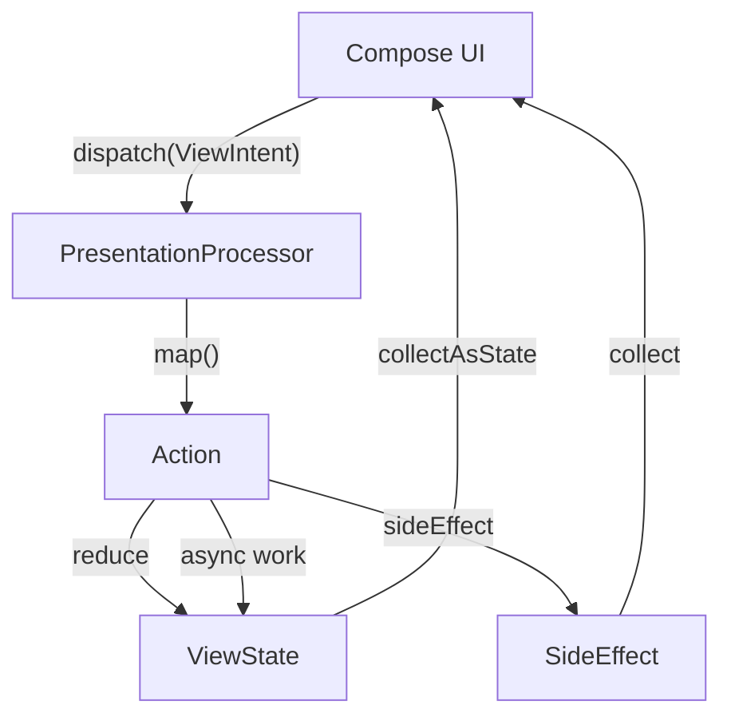
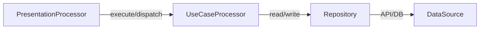

# Kide Developer Guide

Welcome to the definitive guide to **Kide**, the first AI-agent native MVI (Model-View-Intent) and Clean Architecture library built for Kotlin Multiplatform (Android, JVM desktop, iOS).

This guide explains Kide's core concepts and provides practical instructions on how to use its features during development, debugging, and testing.

---

## 1. Core Architecture Concepts

Kide enforces a strict, unidirectional data flow centered around the `PresentationProcessor`. The architecture is designed to be highly predictable, completely lossless, and safe from crashing due to unexpected errors.



### The MVI Contract
Every feature is defined by three interfaces:
1. **`ViewState`**: A completely immutable data class representing the UI's single source of truth.
2. **`ViewIntent`**: A sealed interface representing user actions or UI events.
3. **`SideEffect`**: A sealed interface representing one-off UI actions (like showing a Toast or navigating) that shouldn't be persisted.

### Execution Guarantees
- **Lossless Queues:** Intents are processed strictly sequentially in dispatch order. No intent is ever dropped.
- **Exactly-Once Side Effects:** Side effects are buffered until collected, guaranteeing they are delivered exactly once, even across configuration changes.
- **Deterministic Reductions:** Synchronous state reductions execute inline on the intent loop.
- **Resilience:** If an intent or reduction throws an exception, it is caught, logged, reported, and the processor continues with the next intent. **Your intent loop will never die.**

---

## 2. Development Instructions

### Defining the Contract
Start by creating your MVI models:

```kotlin
data class SearchViewState(
    val query: String = "",
    val results: List<Project> = emptyList(),
    val isLoading: Boolean = false,
) : ViewState

sealed interface SearchIntent : ViewIntent {
    data class UpdateQuery(val query: String) : SearchIntent
    data object TriggerSearch : SearchIntent
}

sealed interface SearchSideEffect : SideEffect {
    data class ShowToast(val message: String) : SearchSideEffect
}
```

### Implementing the Processor
Create a processor by extending `PresentationProcessor`. You only need to implement the `map()` function.

```kotlin
class SearchProcessor(
    private val useCase: SearchUseCase
) : PresentationProcessor<SearchIntent, SearchViewState, SearchSideEffect>(SearchViewState()) {

    override suspend fun map(intent: SearchIntent): Action<SearchViewState, SearchSideEffect>? =
        when (intent) {
            is SearchIntent.UpdateQuery -> reduce { copy(query = intent.query) }

            SearchIntent.TriggerSearch -> composite(
                reduce { copy(isLoading = true) },
                async(cancellationKey = "search_key") {
                    val result = useCase.execute(state.query)
                    reduce { copy(results = result, isLoading = false) }
                }
            )
        }
}
```

> [!TIP]
> **Action Builders**
> - `reduce { ... }`: Fast, synchronous state mutation.
> - `sideEffect { ... }`: Emits a side effect inline.
> - `async { ... }`: Spawns a coroutine for async work. You can assign a `cancellationKey` to cancel previous running async tasks with the same key automatically.
> - `composite(...)`: Chains multiple actions to run sequentially.

## 3. Compose Integration and Navigation

Kide's optional `kide-navigation` module integrates seamlessly with Jetpack Compose. Screens are defined via `ScreenNavKey`, linking a processor to its UI and providing persistence rules.

### Defining a ScreenNavKey
The `ScreenNavKey` defines how to instantiate the processor and how to render the screen. It also provides the state serializer for cross-process state persistence.

```kotlin
object SearchNavKey : ScreenNavKey<SearchProcessor> {
    override val serialKey: String = "search"
    
    // Instantiate processor (e.g., using DI like Koin)
    override fun createProcessor(): SearchProcessor = get()
    
    // Define the Compose UI
    override val screen: @Composable ((ScreenContext<SearchProcessor>) -> Unit)
        get() = { ctx -> SearchScreen(ctx) }

    // Persist the user's search inputs across process death
    override val stateSerializer: KSerializer<out ViewState>
        get() = SearchViewState.serializer()
}
```

### Rendering State in Compose
In your Compose screen, use `ScreenContext` to observe state and side effects:

```kotlin
@Composable
fun SearchScreen(ctx: ScreenContext<SearchProcessor>) {
    val state by ctx.processor.states.collectAsStateWithLifecycle()

    LaunchedEffect(Unit) {
        ctx.processor.sideEffects.collect { effect ->
            when (effect) {
                is SearchSideEffect.ShowToast -> showToast(effect.message)
            }
        }
    }

    // Your UI drawing code here, reacting to `state`
    // Example: dispatching an intent when a button is clicked
    Button(onClick = { ctx.processor.dispatch(SearchIntent.TriggerSearch) }) {
        Text("Search")
    }
}
```

### Navigating Between Screens
Navigation is handled via the `ScreenContext` or directly on the `AppNavBackStack`.
```kotlin
// From within a screen
ctx.navigateTo(DetailsNavKey(projectId = "123"))

// Setting up the root navigation stack in MainActivity
val backStack = rememberAppNavBackStack(SearchNavKey)
AppNavigation(backStack)
```

---

## 4. Dependency Injection Integration (`kide-koin`)

Kide integrates effortlessly with Koin using the optional `kide-koin` module. 

Instead of passing massive dependency trees, you can use Koin's `get()` to resolve your processors within `ScreenNavKey` factories (as shown above in `SearchNavKey.createProcessor()`).

The module also provides lifecycle-aware bindings. Ensure you configure your Koin modules to declare `PresentationProcessor` definitions appropriately (often as `factory` so each screen instance gets a fresh processor).

```kotlin
val searchModule = module {
    factory { SearchUseCase(get()) }
    factory { SearchProcessor(get()) }
}
```

---

## 5. Clean Architecture Integration

For large applications, use the `kide-clean-architecture` module. The UI layers interact with Domain use cases which are themselves intent-driven (`UseCaseProcessor`).



| Component | Description |
|-----------|-------------|
| **`Feature`** | The highest-level logical module grouping related presentation, domain, and data components. |
| **`UseCaseProcessor` / `UseCaseFunction`** | Encapsulates specific business rules or flows. |
| **`Repository`** | Mediates between the domain and data layers, providing domain entities from underlying sources. |
| **`DataSource`** | Abstraction for underlying data storage mechanisms (e.g., REST APIs, local databases). |
| **`Service`** | A generic component to perform operations that don't naturally fit into an entity or repository. |
| **`Manager`** | Manages state or orchestrates other lower-level components. |

### Heavyweight vs Lightweight Use Cases

**Heavyweight Use Cases (`UseCaseProcessor`)**
These act as a middle layer capable of retaining and emitting their own domain states, functioning much like an MVI processor for the domain layer:

```kotlin
class SavedProjectsProcessor(
    private val repository: ProjectRepository
) : AbstractUseCaseProcessor<SavedProjectsState, SavedProjectsIntent>(SavedProjectsState()) {
    
    override suspend fun map(intent: SavedProjectsIntent) {
        // Handle logic, interact with repo, and reduce the state
    }
}
```

**Lightweight Use Cases (`UseCaseFunction`)**
For simpler actions, Kide provides `UseCaseFunction` — a single-abstract-method (SAM) interface designed for very lightweight implementation.

```kotlin
// Domain Definition
fun interface SearchGitHubProjectsUseCase : UseCaseFunction {
    suspend fun execute(query: String, language: String?, license: String?): Result<List<Project>>
}
```

Because it is a functional interface, Kide avoids the boilerplate of creating concrete implementation classes (like `SearchGitHubProjectsUseCaseImpl`). Instead, the interface is implemented directly via a lambda block that delegates to the repository. This is typically wired up in your Dependency Injection configuration:

```kotlin
// Dependency Injection Configuration (e.g., using Koin)
factory<SearchGitHubProjectsUseCase> {
    val repository = get<GitHubRepository>()
    SearchGitHubProjectsUseCase { query, language, license ->
        repository.searchProjects(query, language, license)
    }
}
```

**Benefits of Lightweight Use Cases:**
- **Zero Boilerplate:** Completely eliminates the need to write and maintain redundant `*UseCaseImpl` classes just to forward calls to a repository.
- **Pure and Focused:** Keeps business rules strictly defined by the interface signature.
- **Easy to Mock:** Trivial to mock or fake using lambdas in your unit tests without needing complex mocking frameworks.

---

## 6. Debugging

### Built-in Logging (`KideLog`)
Use the `KideLog` facility, which provides lazy, class-tagged logging functions:

```kotlin
class SearchProcessor : PresentationProcessor<...> {
    fun doSomething() {
        logD { "This runs lazily and tags output as 'SearchProcessor'" }
        logE(exception) { "Something broke" }
    }
}
```

### Agent-Native Debugging (`kide-devtools`)
Kide is specially designed to let AI coding agents debug your running app directly.
Instead of relying only on traditional GUI debug tools, you attach a `FlightRecorder` and `KideMcpServer`.

> [!IMPORTANT]
> Ensure the MCP Server (`KideMcpServer.start(context)`) is strictly limited to debug builds.

Your AI Agent can connect to your running app via an MCP port (`http://localhost:8765/mcp`). 
The Agent can read a queryable trace of the processor's life (intents, actions, state diffs, errors) to instantly find and fix bugs.

---

## 7. Testing

Kide processors are standard Kotlin classes, and testing them is incredibly straightforward using `kide-test`.

> [!IMPORTANT]
> When testing processors, always set the Main dispatcher to `UnconfinedTestDispatcher()`. This ensures that dispatch mechanisms are perfectly synchronous during tests.

```kotlin
// In a Kotest DescribeSpec

beforeSpec {
    Dispatchers.setMain(UnconfinedTestDispatcher())
}

it("updates query and triggers search") {
    val processor = SearchProcessor(FakeSearchUseCase())

    processor.test {
        dispatch(SearchIntent.UpdateQuery("kotlin"))
        expectState { it.query == "kotlin" }
        
        dispatch(SearchIntent.TriggerSearch)
        expectState { it.isLoading }
        // Verify subsequent states...
    }
}
```

The DSL allows you to `dispatch` intents and strictly `expectState` and `expectSideEffect` in exactly the order they occur.

---

## 8. Kide Demo App

The Kide library includes a complete sample application in the `app` module. It serves as a comprehensive reference demonstrating how all the pieces of the Kide ecosystem fit together.

**Key features of the Demo App:**
- **Modularization:** Divided into distinct feature modules (e.g., `feature.search`), demonstrating scalable project structures.
- **Koin Integration:** Fully leverages Koin for dependency injection across presentation, domain, and data layers.
- **Navigation:** Shows advanced usage of `ScreenNavKey`, back-stack management, and cross-process persistence.
- **Clean Architecture:** Implements Repositories, DataSources (using Room and DataStore), and UseCases properly decoupled from the UI.
- **Agent Debugging:** Includes the `kide-devtools` integration out-of-the-box in debug builds, allowing you to connect an AI agent to the emulator and test the MCP features firsthand.
